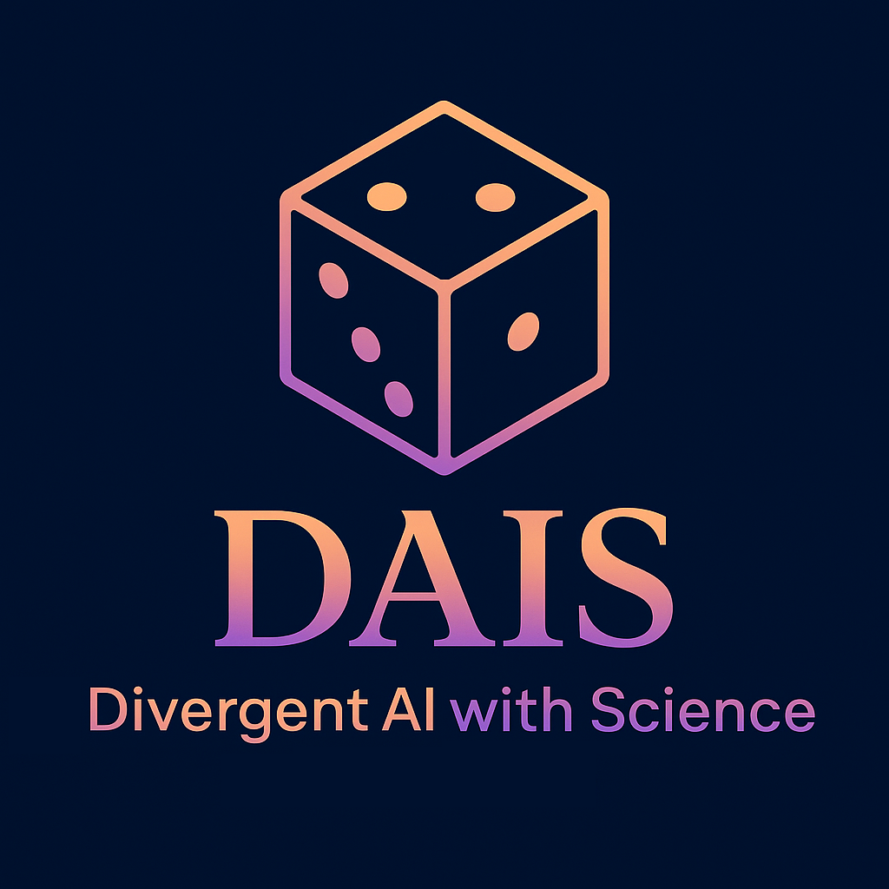

# **SKN09-FINAL-5Team**

> SK네트웍스 Family AI 캠프 9th Fianl Project <br>
> 개발기간: 25.05.21 - 25.06.20

<br><br>

---

# 📚 Contents

1. [프로젝트 소개](#1-Project-Introduction)
2. [프로젝트 개요](#2-Project-Overview)
3. [프로젝트 문서](#3-Project-Documents)
4. [디렉토리 구조](#4-Directory-Diagram)
5. [한 줄 회고](#5-Memoir)

<br><br>

---

# 💡 1. Project Introduction

#### 프로젝트 명: DAIS (Divergent AI with Science)
#### 프로젝트 주제: LLM 활용 인공지능 인플루언서 만들기
#### 프로젝트 세부 주제: 과학 AI 인플루언서

<br>

##### 팀원 소개

<table align="center" width="100%">
  <tr>
    <td align="center">
      <a href="https://github.com/SIQRIT"><b>@조이현</b></a>
    </td>
  </tr>
  <tr>
    <td align="center"></td>
  </tr>
</table>

<br><br>

---

# ♦️ 2. Project Overview

### 프로젝트 소개
프로젝트 DIAS는 LLM(대형 언어 모델)을 기반으로 개발한 인공지능 인플루언서 모델에 웹 페이지를 연동하여, 실제 사용자들이 과학에 대한 막연한 두려움을 낮추고 궁금증을 해결할 수 있는 과학 AI 인플루언서입니다. Divergent AI with Science라는 이름의 줄임말답게 입체적인 말투를 구사하며, 일상적인 궁금증에서 학문적인 문제까지 손쉽게 다가갈 수 있습니다. DAIS는 여러분들의 과학에 대한 궁금증을 해결하기 위한 하나의 이정표가 되어주고자 합니다.

<br><br>

---

# ✅ 3. Project Documents

[WBS](./01_docs/01_SKN09-Final-5Team.xlsx)


[요구사항 정의서](./01_docs/01_SKN09-Final-5Team.xlsx)


[데이터베이스 설계 문서](./01_docs/01_SKN09-Final-5Team.xlsx)


[사용자 시나리오 설계서](./01_docs/01_SKN09-Final-5Team.xlsx)


[데이터 수집 결과서](./01_docs/02_데이터%20수집%20결과서.docx)


[데이터 전처리 결과서](./01_docs/03_데이터%20전처리%20결과서.docx)


[인공지능 데이터 결과서](./01_docs/04_인공지능%20데이터%20결과서.docx)


[프로젝트 기획서](./01_docs/05_프로젝트%20기획서.docx)


[시스템 아키텍쳐](./01_docs/06_시스템%20아키텍쳐.png)


[화면 설계서](./01_docs/07_화면%20설계서.docx)


[인공지능 학습 결과서](./01_docs/08_인공지능%20학습%20결과서.docx)


[모델 테스트 계획 및 결과 보고서](./01_docs/09_모델%20테스트%20계획%20및%20결과%20보고서.docx)


[시스템 구성도](./01_docs/10_시스템%20구성도.docx)


<br><br>

---

# ⬇️ 4. Directory Diagram

```
MUSE/
├── 📁 .github/
│   ├──📁 ISSUE_TEMPLATE/
│   │  ├── bug_report.md
│   │  └── feature_request.md
│   └── pull_request_template.md
│
├── 📁 01_docs/
│   ├── 01_SKN09-Final-5Team.xlsx
│   ├── 02_데이터 수집 결과서.docx
│   ├── 03_데이터 전처리 결과서.docx
│   ├── 04_인공지능 데이터 결과서.docx
│   ├── 05_프로젝트 기획서.docx
│   ├── 06_시스템 아키텍쳐.png
│   ├── 07_화면 설계서.docx
│   ├── 08_인공지능 학습 결과서.docx
│   ├── 09_모델 테스트 계획 및 결과 보고서.docx
│   ├── 10_시스템 구성도.docx
│   ├── DAIS_ERD.damx
│   └── DAIS_ERD.architecture.png
│
├── 📁 02_data_preparing/
│   ├── __init__.py
│   ├── 01_oauth.py
│   ├── 02_requests.py
│   └── 03_crawling.py
│
├── 📁 03_data_preprocessing/ 
│   ├── 📁 data/
│   │   ├── 01_youtube_scripts.jsonl
│   │   ├── 02_dedup_input.jsonl
│   │   ├── 03_dedup_output.jsonl
│   │   ├── 04_refined_scripts.jsonl
│   │   ├── 05_cleaned_scripts.jsonl
│   │   ├── 06_filtered_scripts.jsonl
│   │   ├── 07_api_scripts.jsonl
│   │   └── 08_preprocessed_scripts.jsonl
│   │
│   ├── __init__.py
│   ├── 01_data_deduping.py
│   ├── 02_data_refining.py
│   ├── 03_data_length.py
│   ├── 04_data_english.py
│   ├── 05_data_api.py
│   └── 06_data_preprocessing.py
│
├── 📁 04_data_postprocessing/ 
│   ├── 📁 data/
│   │   ├── 08_preprocessed_scripts.jsonl
│   │   └── 09_postprocessed_scripts.jsonl
│   │
│   └── 07_data_postprocessing.py
│
├── 📁 05_fine_tuning/ 
│   ├── 📁 data/
│   │   └── 09_postprocessed_scripts.jsonl
│   │
│   ├── 📁 vectordb/
│   │   ├── dais_vectorstore.index
│   │   ├── dais_vectorstore_meta.jsonl
│   │   ├── index.faiss
│   │   └── index.pkl
│   │
│   ├── 01_model_fine_tuning.ipynb
│   ├── 02_model_results.ipynb
│   ├── 03_langchain_faiss.ipynb
│   ├── 04_build_vector_db.ipynb
│   ├── 05_rag_inference.ipynb
│   ├── 06_huggingface_upload.ipynb
│   └── 07_model_test.ipynb
│
├── 📁 06_streamlit/ 
│   ├── 📁 images/
│   │   ├── DAIS-BI-removebg-preview.png
│   │   ├── DAIS-BI.png
│   │   ├── DAIS_chatbot_profile.png
│   │   ├── DAIS_default_profile.png
│   │   └── DAIS_user_profile.png
│   │
│   ├── 📁 pages/
│   │   └── DAIS_SERVICE.py
│   │
│   └── MAIN_PAGE.py
│
├── .gitignore
└── README.md
```

<br><br>

---

# 🤭 5. 한 줄 회고
- **조이현**: 이번 프로젝트를 통해 적은 양의 데이터 및 모델 특성을 고려한 최신 파인튜닝 논문 트렌드인 Q-DoRA 기법과 기존 프롬프트 엔지니어링을 강화하여 모델 출력을 보다 확실하게 제어하기 위한 스페셜 토큰을 추가 임베딩 시킴으로써와 주제 및 도메인에 적합한 기술스택을 새로이 익혔다. 한 달도 안되는 짧은 시간동안 파이널 프로젝트의 모든 과정을 홀로 핸들링함으로써 어떤 환경에서라도 할 수 있다는 자신감 또한 얻을 수 있는 좋은 계기가 되었다.

<br><br>
